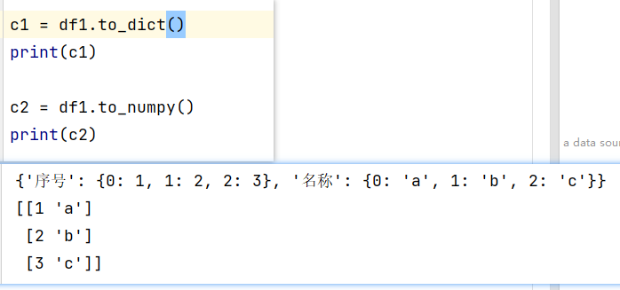

### 前言

#### 简介

>+ 数据挖掘需要可以解决的问题：
>	+ 分类问题：已知类别，进行分类
>	+ 聚类问题：不知道类别，确定类别，进行分类
>	+ 回归问题：生成的结果是连续的；例：预测房价的增长
>	+ 关联问题：推荐
>+ 方法论：
>	+ CRISP-DM流程（Cross-industry Standard Process For Data Mining）跨行业数据挖掘标准流程
>		+ 业务理解（解决什么问题） ->  数据理解  -> 数据准备 -> 构建/训练模型 -> 评估模型 -> 模型部署 
>
>

#### 依赖技能

##### Python

>+ 注意内容：
>	+ 声明一个变量时可以不声明它的类型，在赋值是确定类型；
>	+ 在声明的容器型变量中，内部的元素类型是任意的；
>	+ 列表、集合和字典非常频繁地使用；
>	+ 数据挖掘过程中，数据通常以向量的方式表示、存储在列表中；
>+ 列表（list）：有序可重复的数组，主要用于按顺序存放数据；
>	+ list=['one', 'two', 3, 4, 5]
>	+ 常用操作：
>		+ list[2]='three'  #修改位于位置2的列表元素
>		+ len(list) #返回列表的长度
>		+ list1+list2 #列表相加，返回一个新的列表，里面按顺序有list1和list2 的所有元素
>		+ list1*2 #列表重复，返回一个新的列表，里面按顺序出现list1中的元素两次；
>		+ x in list #判断list中是否有x这个元素
>+ 集合（set）：集合是一个无序的不重复序列，可以使用大括号{}或者set()函数创建集合；
>	+ 注意：创建一个空集合必须用set()而不能用{}，因为{}是用来创建一个空字典的；
>	+ 常用操作：
>		+ abc.add(x) #向abc中加入元素x
>		+ abc.remove(x) #从abc中删除元素x
>+ 字典（dict)
>	+ 字典中存放的每一个元素是一个键值对（key:value)
>	+ key是不能重复的，存入相同的key，它的value会被替换成最新的；
>	+ dict={}代表使用大括号声明一个空字典；
>	+ 字典中的元素可以是任意类型，比如数值、字符串、列表，甚至是字典；
>	+ 常用操作：
>		+ dict['c']=3  #向字典中添加键值对
>		+ del dict['a'] #从字典中删除键值对
>+ 注释：
>	+ #或‘’‘或”“”
>+ 使用**缩进**进行标记代码块
>	+ 代码太长，需要分割成多行，可以使用“\”进行连接，在括号里的内容，不需要使用“\”，直接换行；
>+ 导入其它模块
>	+ import 主要作用是导入整个模块，或者导入模块中的模块
>	+ from ... import 是从某个模块中导入某个方法（函数）
>	+ 常用操作：
>		+ import tensorflow as tf #导入tensorflow模块，并起一个新名字tf，这主要是为了方便代码编写；
>		+ from model import yolov3 #从model模块导入yolov3方法；
>		+ from math import * #从math模块导入所有方法；
>+ 常用语句
>	+ 条件语句
>		+ if条件： 执行 elif条件：执行 else:执行
>	+ 循环语句
>		+ while循环：
>			+ while a>b: 
>		+ for循环：
>			+ for i in range(0,100):
>	+ continue
>	+ break
>	+ pass:代表什么都没有，主要用于一些特殊的位置，一个占位代码，不影响其它程序执行；
>
>+ 数据类型：
>
>	+ 单一类型：整型、浮点型、复数、字符、逻辑型等。
>	+ 四种集合数据类型：
>		+ 列表（List）一种有序和可更改的集合。允许重复的成员；
>			+ Python没有内置对数组的支持，一般使用列表来代替；
>			+ pandas包中提供了功能更强的pd.Series，可以简单理解为带索引的有序列表；
>		+ 元组（Tuple) 一种有序且不可更改的集合。允许重复的成员；
>		+ 集合（Set) 一种无序和无索引的集合。没有重复的成员；
>		+ 词典（Dictionary）一种无序，可变和有索引的集合。没有重复的成员；
>			+ 无序、有索引、可修改、有重复
>			+ 键名必须是常数，不重复，键值可以是变量。
>	+ 字符串在python中会被理解为单个字符构成的特殊list
>		+ “早上好”==[“早“，”上“，”好”] => false
>	+ Series
>		+ python的原生数据结构中没有和数组对应的类型。
>		+ list虽然比较接近数组的需求，但是没有索引和排序功能；
>		+ pd.Series可以被简单理解为带索引的有序列表，从而能够更好的满足数据分析的需求；
>
>+ 函数和错误处理
>
>	+ ```python
>		def fun1():
>			prin("调用函数")
>			
>			
>		fun1()
>		
>		#-------------
>		def fun2(var):
>			b=var*2
>			return b #无return语句时默认返回最后一句的赋值
>		
>		a=10
>		fun2(a)
>		```
>
>	+ 错误处理：
>
>		+ ```python
>			try:
>			    需要进行错误捕获的代码段
>			 except:
>			    	出错后需要执行的代码段
>			  else:
>			      没有出错时需要执行的代码段
>			```
>
>		+ 

+ 标准库

>Python的标准库是其核心的扩展，包括操作系统接口、文件操作、输入输出流、文本处理等功能；
>
>+ dir() #查看模块中所包含的工具；
>	+ dir(math)
>+ help() #展示模块中所有方法的说明；
>
>+ 数据挖掘中常用模块
>	+ 数学模块(math): 
>	+ 日期时间模块(datetime)：
>	+ 随机模块（random）：
>	+ 文件操作模块（file）:
>	+ 正则匹配模块（re）：
>	+ 系统接口模块（sys)：主要实现了与操作系统交互的一些功能，如获取当前操作系统的情况、设置编码格式等，编写完整的程序通常都会用到 -- 为了获取系统的各种数据；

+ 第三方库--基础模块

>+ NumPy : Python语言扩展程序库，支持大量的维度数组与矩阵计算；
>+ SciPy：集成了数学、科学和工程的计算包，它用于有效计算Numpy矩阵，使Numpy和Scipy协同工作；
>+ Matplotlib：专门用来绘图的工具包，可以使用它进行数据可视化；
>+ pandas：数据分析工具包，它基于NumPy构建，纳入了大量的库和标准数据模型；
>
>

+ 第三方库--机器学习常用

>+ scikit-learn：基于Scipy进行延伸的机器学习工具包，包含大量的机器学习算法模型，有6大基本功能：分类、回归、聚类、数据降维、模型选择和数据预处理；
>+ OpenCV：非常庞大的图像处理库，实现了非常多的图像和视频处理方法，如图像视频加载、基础特征获取、边缘检测等，处理图像通常都需要其支持；
>+ NLTK：比较传统的自然语言处理模块，自带很多语料，以及全面的传统自然语言处理算法，比如字符串处理、卡方检验等，非常适合自然语言入门使用；
>+ Gensim：包含了浅层词嵌入的文本处理模块，以及常用的自然语言处理相关方法，如TF-IDF、word2vec等模型；
>
>

+ 第三方库--深度学习平台

>+ TensorFlow：谷歌 相对成熟、应用广泛、服务全面、
>+ PyTorch: Facebook 支持更加快速的构建项目
>+ PaddlePaddle：百度 中文文档全面，对于汉语的相关模型比较丰富；

##### 安装扩展包

>+ 使用pip安装扩展包，以安装TensorFlow为例：
>	+ pip install tensorflow #安装最新的tensorflow模块
>	+ pip install ternsorflow=1.14 #安装版本为1.14的tensorflow模块
>	+ pip install tensorflow>=1.14 #安装1.14以上版本的tensorflow模块；
>+ 用pip卸载某个模块：
>	+ pip uninstall ternsorflow
>+ 在pip库中搜索某个模块：
>	+ pip search tensorflow
>+ 用pip显示已安装的包
>	+ pip list
>
>+ 切换镜像源
>	+ pip install tensorflow -i https://pypi.tuna.tsinghua.edu.cn/simple
>	+ 用pip更新配置文件，修改默认源
>		+ pip config set global.index-url https://pypi.tuna.tsinghua.edu.cn/simple
>+ anaconda:
>	+ 是包管理器，也是环境管理器，更是Python的编辑器
>	+ 致力于为用户提供更便捷的方式来使用Python，进行数据科学计算和机器学习；
>	+ 开源软件库sklearn、TensorFlow和scipy都支持Anaconda
>	+ 为什么使用anaconda
>		+ 依赖包安装方便：预装150+依赖包，提供250+可选开源依赖包，可以直接使用命令conda install,也可以使用pip install命令安装，甚至可以使用conda build来构建你自己的依赖包；
>		+ 支持多平台
>		+ 多环节切换：
>			+ Anaconda依据不同的项目依赖构建多套互不干扰的环境，随时切换，迁移项目到其它机器上，只需要把打包的环境一并移到新的服务器上；


##### Python API

+ 读入文本格式文件

>```python
>pd.read_csv(
>	filepath_or_buffer #要读入的文件路径
>    sep = ',' #列分隔符
>    header = 'infer' #指定数据中的第几行作为变量名
>    names = None #自定义变量名列表
>    index_col = None #将会被用作索引的列名，多列时只能使用序号列表
>    usecols = None #指定只读入某些列，使用索引列表或者名称列表均可。
>    	[0, 1, 3] 或者 ["名次", "学校名称", "所在地区"]
>    encoding = None #读入文件的编码方式
>    	utf-8/GBK 中文数据文件最好设定为utf-8
>    na_values #指定将被读入为缺失值的数值列表，默认下列数据被读入为缺失值：
>    	'', '#N/A', '#N/A N/A'， '#NA'， '-1.#IND'， '-1.#QNAN'， '-NaN'， '-nan'， '1.#IND'，'1.#QNAN'，'N/A'，'NA'，'NULL'，'NaN'， 'n/a'， 'nan'， 'null'
>);
>
>#读取csv格式文件，但也可通用于文本文件读取；
>
>pd.read_table("1.csv", sep=',', enconding='utf-8')
>
>```
>
>
>
>

##### 常用函数

>+ count()
>+ size()
>+ sum()
>+ mean() 平均值
>+ median()
>+ min()
>+ max()
>+ std() 
>+ var()
>+ skew()
>+ kurt()
>+ quantile()
>+ apply()
>+ cov()
>+ corr()
>
>

+ 特殊函数

>+ argmin 和 argmax  最小值和最大值对应的绝对值（整数）
>+ idxmin 和 idxmax 最小值和最大值对应的索引值
>
>

##### 读入/写出命令总结

|                    |                                          |                      |
| ------------------ | ---------------------------------------- | -------------------- |
| 数据格式           | 读入命令                                 | 保存命令             |
| 剪贴板             | read_clipboard                           | to_clipboarb         |
| 一般有分隔符的文件 | read_table                               |                      |
|                    | read_fwf                                 |                      |
| CSV                | read_csv                                 | to_csv               |
| MS Excel           | read_excel                               | to_excel             |
| JSON               | read_json                                | to_json              |
| HTML               | read_html                                | to_html              |
| Stata              | read_stata                               | to_stata             |
| SAS                | read_sas                                 |                      |
| SPSS               | read_spss                                | pyreadstat.write_sav |
| SQL                | read_sql、read_sql_query、read_sql_table | to_sql               |
| Google BigQuery    | read_gbq                                 | to_gbq               |
| HDF5 Format        | read_hdf                                 | to_hdf               |
| Feather Format     | read_feather                             | to_feather           |
| Parquet Format     | read_parquet                             | to_parquet           |
| ORC Format         | read_orc                                 |                      |
| Msgpack            | read_msgpack                             | to_msgpack           |
| Python Pickle      | read_pickle                              | to_pickle            |


##### pandas中将DataFrame转换为其他数据格式的命令

|                                 |             |
| ------------------------------- | ----------- |
| 数据格式                        | 转换命令    |
| dict格式                        | to_dict     |
| Markdown-friendly表格格式       | to_markdown |
| console-friendly tabular output | to_string   |
|                                 |             |
| NumPy array                     | to_numpy    |
| NumPy record array              | to_records  |
|                                 |             |
| latex格式                       | to_latex    |
| parquet format                  | to_parquet  |
| xarray object                   | to_xarray   |

  

##### describe命令

>一次性输出常用的集中趋势和离散趋势汇总指标
>
>百分位数的输出为其特色功能；
>
>```python
>df.describe(
>	percentiles # 需要输出的百分位数，列表格式提供，如[.25, .5, .75]
>    include = 'None' #要求纳入分析的变量类型白名单
>    	None (default) #只纳入数值变量列
>    	A list-like of dtypes # 列表格式提供希望纳入的类型
>    	'all' #全部纳入
>    exclude #要求剔除出分析的变量类型黑名单，选项同上
>)
>```
>
>
>
>

#### 变量的统计描述

##### 连续变量的统计描述

+ describe命令
+ statsmodels的实现

##### 分类变量的统计描述

+ 单变量的频数统计

>```Python
>Series.value_counts(
>	normalize = False #是否返回构成比而不是原始频数
>    sort = True #是否按照频数排序（否则按照原始顺序排列）
>    ascending = False #是否升序排列
>    bins # 对数值变量直接进行分段，可看作是pd.cut的简便用法。
>    dropna = True ：结果中是否包含NaN
>)
>```
>
>

+ 交叉表(分组展示，纵横分组)
	+ pandas的crosstab命令可以完成基本的制表任务，但是和统计软件中的同类命令不同，缺少进行行列变量关联性检验的功能，这方面的任务需要使用statsmodels完成

>```python
>pd.crosstab(
>	行列设定
>    	index / columns # 行变量/列变量 ，多个时以list形式提供
>    单元格设定
>    	values # 在单元格中需要汇总的变量列，需要进一步指定 aggfunc
>    	aggfunc # 相应的汇总函数
>    行列百分比计算
>    	normalize = False : {'all', 'index', 'columns'}, or {0, 1}
>    	'all' / True #总计百分比
>    	'index' / 0 #分行计算百分比
>    	'columns' / 1 # 分列计算百分比
>    	当margins = True时，也同时计算边际汇总的百分比
>    汇总设定
>    	margins = False #是否加入行列汇总
>    	margins_name =  'ALL' # 汇总行/列的名称
>    dropna = True
>)
>```
>
>
>
>

##### 单因变量回归类模型的基本框架

|                              |                                                |                                                              |
| ---------------------------- | ---------------------------------------------- | ------------------------------------------------------------ |
| 数据状况                     | 应对模型                                       | Python函数                                                   |
| 数据为理想状态               | 线性回归模型/一般线性模型                      | statsmodels.regression.linear_model/ sklearn.linear_model.LinearRegression |
| 非线性关联/存在高此项/交互项 | 曲线直线化，多项式回归                         | sklearn.preprocessing.PolynomialFeatures                     |
| 自变量筛选                   | 逐步回归，最小角回归（LARS)                    | sklearn.linear_model.Lars                                    |
| 自变量存在共线性             | 岭回归，Lasso回归，弹性网络，偏最小二乘法(PLS) | sklearn.linear_model.Ridge/ sklearn.linear_model.Lasso/ sklearn.linear_model.ElasticNet/ sklearn.cross_decomposition.PLSRegression |
| 残差方差不齐                 | 加权最小二乘法                                 | statsmodels.regression.linear_model.WLS                      |
| 残差自相关/不独立            | 自回归，混合线性模型，GEEs                     | statsmodels.tsa.vector_ar/ statsmodels.regression.mixed_linear_model.MixedLM/  statsmodels.genmod.generalized_estimating_equations.GEE |
| 存在强影响点/异常值          | 稳健回归                                       | statsmodels.robust.robust_linear_model.RLM                   |


##### 分类预测模型的基本框架

| 模                    |                                                              |                                                              |
| --------------------- | ------------------------------------------------------------ | ------------------------------------------------------------ |
| 模型名称              | 模型特点                                                     | Python函数                                                   |
| 判别分析 Logistic回归 | 类别分界为线性，速度快，很容易用于高维/超大数据集            | sklearn.discriminant_analysis.LinearDiscriminantAnalysis/ sklearn.linear_model.LogisticRegression |
| 神经网络              | 复杂分类问题，速度慢，表达困难，对数据缩放敏感，对参数选取敏感 | sklearn.neural_network                                       |
| 树模型                | 复杂分类问题，速度快，容易可视化                             | sklearn.tree.DecisionTreeClassifier                          |
| SVM                   | 很适合与特征含义相似的中等大小数据集，对数据缩放敏感，对参数选取敏感 | sklearn.svm                                                  |
| K近邻                 | 适用于中小型数据集，容易解释                                 | sklearn.neighbors.KNeighborsClassifier                       |
| 朴素贝叶素            | 速度快，适用于超大数据集/高维数据精度通常低于线性模型        | sklearn.linear_model.BayesianRidge                           |
| 随机森林              | 表现稳健，不适用于高维稀疏矩阵                               | sklearn.ensemble.RandomForestClassifier                      |
| 梯度提升决策树        | 精度通常比随机森林略高，比随机森林需要更多的参数调节         | sklearn.ensemble.GradientBoostingClassifier                  |


### ChatGTP

#### 术语

>+ 预训练 （督导式学习、）
>+ 强化学习
>+ 生成式学习
>	+ 策略一：各个击破
>	+ 策略二：一次到位
>
>