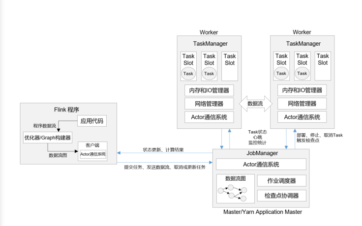
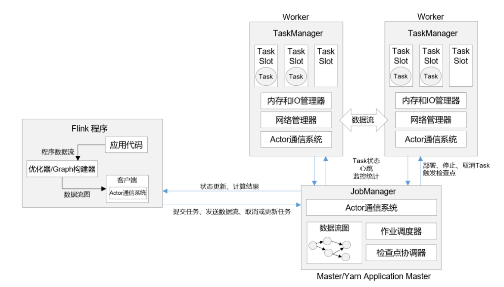

#### 序言:

> ​	Flink几个关键组件：客户端（Client）、作业管理器（JobManager）和任务管理器（TaskManager）.
> ​    我们的代码实际由客户端获取并做转换，之后提交给JobManager的。所以JobManager是Flink集群里的管事人，
> ​    对作业进行中央调度管理，而它获取到要执行的作业后，回进一步处理转换，然后分发任务给众多的TaskManager。
> ​    这里的TaskManager就是真正干活的人，数据的处理擦偶哦在都是它们来做的。

### 一、Flink快速体验

#### 1.本地启动 [local]

>+ 1.下载安装包。 Flink官网下载1.13.2版本安装包flink-1.13.2-bin-scala_2.12.tgz (注意选择scala 2.12)
>
>+ 2.解压。
>	    $ tar -zxvf flink-1.13.0-bin-scala_2.12.tgz -C /opt/module/
>
>+ 3.启动。 进入解压后的目录，执行启动命令，并查看进程。
>	    $ cd flink-1.13.0/
>	        $ bin/start-cluster.sh
>	        Starting cluster.
>	        Starting standalonesession daemon on host hadoop102.
>	        Starting taskexecutor daemon on host hadoop102.
>	        $ jps
>	        10369 StandaloneSessionClusterEntrypoint
>	        10680 TaskManagerRunner
>	        10717 Jps
>
>+ 4.访问Web UI.
>	    启动成功后，访问 http://node01:8081，可以对 flink 集群和任务进行监控管理.
>
>+ 5.关闭集群.
>	    如果想要让 Flink 集群停止运行，可以执行以下命令：
>	        $ bin/stop-cluster.sh
>	        Stopping taskexecutor daemon (pid: 10680) on host node01.
>	        Stopping standalonesession daemon (pid: 10369) on host node01.

#### 2.集群启动 [standalone]

>+ 可以看到Flink本地启动非常简单的，直接执行start-cluster.sh就行.如果我们想要扩展成集群，其实启动命令是不变的，主要是需要指定节点之间的主从关系。
>+ Flink是典型的Master-Slave架构的分布式数据处理框架，其中Master角色对应这JobManager,Slave角色则对应TaskManager.我们对三台节点服务器的角色分配. node01:JobManager node02:TaskManager node03:TaskManager
>+ 1.下载并解压安装包.(与本地启动相同)
>+ 2.修改集群配置
>	+ a> 进入conf目录下，修改flink-conf.yaml文件，修改jobmanager.rpc.address参数为node01 如下：
>		        $ cd conf/
>		        $ vim flink-conf.yaml
>		        #JobManager 节点地址.
>		        jobmanager.rpc.address: node01
>		    这就指定了node01节点服务器为JobManager节点.
>	+ b> 修改workers文件，将另外两台节点服务器添加为本Flink集群的TaskManager节点，具体修改如下:
>		        $ vim workers
>		        node02
>		        node03
>		    这就指定了node02和node03为TaskManager节点.   
>	+ c> 另外,在flink-conf.yaml文件中还可以对集群中的JobManager和TaskManager组件进行优化配置，主要配置如下：
>		        ⚫ jobmanager.memory.process.size：对 JobManager 进程可使用到的全部内存进行配置，
>		        包括 JVM 元空间和其他开销，默认为 1600M，可以根据集群规模进行适当调整。
>		        ⚫ taskmanager.memory.process.size：对 TaskManager 进程可使用到的全部内存进行配置，
>		        包括 JVM 元空间和其他开销，默认为 1600M，可以根据集群规模进行适当调整。
>		        ⚫ taskmanager.numberOfTaskSlots：对每个 TaskManager 能够分配的 Slot 数量进行配置，
>		        默认为 1，可根据 TaskManager 所在的机器能够提供给 Flink 的 CPU 数量决定。所谓
>		        Slot 就是 TaskManager 中具体运行一个任务所分配的计算资源。
>		        ⚫ parallelism.default：Flink 任务执行的默认并行度，优先级低于代码中进行的并行度配
>		        置和任务提交时使用参数指定的并行度数量。
>+ 3.分发安装目录
>	    配置修改完毕后，将 Flink 安装目录发给另外两个节点服务器。
>	    $ scp -r ./flink-1.13.2 root@node01:/opt/module
>	    $ scp -r ./flink-1.13.2 root@node01:/opt/module
>+ 4.启动集群
>	+ a> 在node01节点服务器上执行 start-cluster.sh 启动 Flink 集群：
>		        $ bin/start-cluster.sh
>		        Starting cluster.
>		        Starting standalonesession daemon on host hadoop102.
>		        Starting taskexecutor daemon on host hadoop103.
>		        Starting taskexecutor daemon on host hadoop104.
>	+ b> 查看进程情况：
>		        [root@node01 flink-1.13.2]$ jps
>		        13859 Jps
>		        13782 StandaloneSessionClusterEntrypoint
>		        [root@node02 flink-1.13.2]$ jps
>		        12215 Jps
>		        12124 TaskManagerRunner
>		        [root@node03 flink-1.13.2]$ jps
>		        11602 TaskManagerRunner
>		        11694 Jps
>+ 5.访问Web UI
>	    启动成功后，同样可以访问 http://node01:8081 对 flink 集群和任务进行监控管理。
>	    可以很明显看到，当前集群的TaskManager数量为2；由于默认每个TaskManager的Slot数量为1，
>	    所以Slot数和可用Slot数都为2.

#### 3.向集群提交作业

​    既然有了真正的集群环境，那接下来我们就要把作业提交上去执行了。

>+ 1.程序打包
>	+ a> 为了方便自定义结构和定制依赖，我们可以引入插件 maven-assembly-plugin进行打包.
>		        在项目的pom.xml文件中添加打包插件的配置，具体如下：
>		            <build>
>		                <plugins>
>		                    <plugin>
>		                        <groupId>org.apache.maven.plugins</groupId>
>		                        <artifactId>maven-assembly-plugin</artifactId>
>		                        <version>3.0.0</version>
>		                        <configuration>
>		                            <descriptorRefs>
>		                                <descriptorRef>jar-with-dependencies</descriptorRef>
>		                            </descriptorRefs>
>		                        </configuration>
>		                        <executions>
>		                            <execution>
>		                                <id>make-assembly</id>
>		                                <phase>package</phase>
>		                                <goals>
>		                                    <goal>single</goal>
>		                                </goals>
>		                            </execution>
>		                        </executions>
>		                    </plugin>
>		                </plugins>
>		            </build>
>	+ b> 插件配置完毕后，使用IDEA的maven工具执行package命令，出现如下日志，表示打包成功.
>		    [INFO] -----------------------------------------------------------------------
>		    [INFO] BUILD SUCCESS
>		    [INFO] -----------------------------------------------------------------------
>		    [INFO] Total time: 21.665 s
>		    [INFO] Finished at: 2021-06-01T17:21:26+08:00
>		    [INFO] Final Memory: 141M/770M
>		    [INFO] -----------------------------------------------------------------------
>		打包完成后，在target目录下即可找到所需JAR包，JAR包会有2个，XXX-1.0-SNAPSHOT.jar 和 XXX-1.0-SNAPSHOT-jar-with-dependencies.jar
>		因为集群中已经具备任务运行所需的所有依赖，所以建议使用XXX-1.0-SNAPSHOT.jar
>+ 2.在Web UI 上提交作业.
>	+ a> 任务打包完成后，我们打开Flink的WEB UI页面，在右侧导航栏点击“Submit New Job”,
>		        然后点击按钮"+ Add New"， 选择要上传的JAR包.
>	+  b> 点击该JAR包，出现任务配置页面，进行相应配置。
>		        主要配置程序入口主类的全类名，任务运行的并行度，任务运行所需的配置参数和保存点路径等，
>		        配置完成后，即可点击按钮"Submit"，将任务提交到集群运行.   
>	+ c> 任务提交成功后，可点击左侧导航栏的"Running Jobs"查看程序运行列表情况.
>
>	+ d> 点击该任务,可以查看任务运行的具体情况,也可以通过点击"Cancel Job"结束任务运行.
>
>+ 3.命令行提交作业
>	    除了通过WEB UI界面提交任务之外，也可以直接通过命令行提交任务。这里为方便起见，我们可以先把
>	    jar包直接上传到目录flink-1.13.2下
>	+ 1> 首先需要启动集群
>		        $ bin/start-cluster.sh
>	+ 2> 在node01执行一下命令启动netcat
>		        $ nc -lk 7777
>	+  3> 进去到Flink的安装路径下，在命令行使用flink run命令提交作业
>		        $ bin/flink run -m node01:8081 -c com.atguigu.wc.StreamWordCount ./FlinkTutorial-1.0-SNAPSHOT.jar
>		        这里的参数 -m 指定了提交到的JobManager， -c 指定了入口类
>	+ 4> 在浏览器中打开Web UI，http://node01:8081 查看应用执行情况
>		        用netcat输入数据，可以在TaskManager的标准输出(Stdout)看到对应的统计结果.
>	+  5> 在log日志中,也可以看到执行结果，需要找到执行该数据任务的TaskManager节点,查看日志.
>		        $ cat flink-atguigu-taskexecutor-0-hadoop102.out
>		        SLF4J: Class path contains multiple SLF4J bindings.
>		        SLF4J: Found binding in
>		        [jar:file:/opt/module/flink-1.13.0/lib/log4j-slf4j-impl-2.12.1.jar!/org/slf4j
>		        /impl/StaticLoggerBinder.class]
>		        SLF4J: Found binding in
>		        [jar:file:/opt/module/hadoop-3.1.3/share/hadoop/common/lib/slf4j-log4j12-1.7.
>		        25.jar!/org/slf4j/impl/StaticLoggerBinder.class]
>		        SLF4J: See http://www.slf4j.org/codes.html#multiple_bindings for an explanation.
>		        SLF4J: Actual binding is of type [org.apache.logging.slf4j.Log4jLoggerFactory]
>		        (hello,1)
>		        (hello,2)
>		        (flink,1)
>		        (hello,3)
>		        (scala,1)

### 二、部署模式

>  在一些应用场景中，对于集群资源分配和占用的方式，可能会有特定的需求。Flink为各种场景提供了不同的部署模式，
>    主要有以下3种：
>        会话模式（Session Mode）
>        单作业模式（Per-Job Mode）
>        应用模式（Application Mode）
>    它们的区别主要在与：
>        集群的生命周期以及资源的分配方式;
>        以及应用的main方法到底在哪里执行--客户端（Client）还是JobManager。

#### 1.会话模式（Session Mode）【短平快作战】

>会话模式其实最符合常规思维。我们需要先启动一个集群，保持一个会话，在这个会话中通过客户端提交作业。
>集群启动时所有资源就已经确定，所以所有提交的作业会竞争集群中的资源。
>
>+ 好处： 只需要一个集群，就像一个大箱子，所有的作业提交之后都塞进去；集群的生命周期是超越与作业之上的，
>    铁打的营盘流水的兵，作业结束了就释放资源，集群依然正常运行。
>+ 缺点： 当然缺点也是显而易见的，因为资源是共享的，所以资源不够了，提交新的作业就会失败。
>    另外，同一个TaskManager上可能运行了很多作业，如果其中一个发生故障导致TaskManager宕机，那么所有作业都会收到影响.
>前面先启动集群再提交作业，这种方式其实就是会话模式.
>+ 适合场景：会话模式比较适合于单个规模小，执行时间短的大量作业。

#### 2. 单作业模式（Per-Job Mode）

> + 会话模式因为资源共享会导致很多问题，所以为了更好地资源隔离，我们可以考虑为每个提交的作业启动一个集群，这就是所谓的单作业模式。
>    + 单作业模式也很好理解，就是严格的一对一，集群只为这个作业而生。同样由客户端运行应用程序，然后启动集群，作业被提交给JobManager,进而分发给TaskManager执行。作业完成后，集群就会关闭，所有资源也会释放，这样一来，每个作业都有它自己的JobManager管理，占用独享的资源，即使发生故障，它的TaskManager宕机也不会影响其它的作业。
>    	这些特性使得单作业模式在生产环境运行更加稳定，所以是实际应用的首选模式。
>    + 需要注意的是，FLink本身无法直接这样运行，所以单作业模式一般需要借助一些资源管理框架来启动集群，比如Yarn、Kubernetes.

#### 3. 应用模式（Application Mode）

>​		前面提到的两种模式下，应用代码都是在客户端上执行，然后由客户端提交给JobManager的。但是这种方式客户端需要占用大量网络宽带，去下载依赖和把二进制数据发送给JobManager;加上很多情况下我们提交作业用的是同一个客户端，就会加重客户端所有节点的资源消耗。
>​       所以解决办法就是，我们不要客户端了，直接把应用提交到JobManager上运行。而这也就是代表着，我们需要为每一个提交的应用单独启动一个JobManager,也就是创建一个集群了。这个JobManager只为执行这一个应用而存在，执行结束之后JobManager也就关闭了，这就是所谓的应用模式.
>
>+ 总结：应用模式与单作业模式，都是提交作业之后才创建集群；单作业模式是通过客户端来提交的，客户端解析出的每一个作业对应一个集群；而应用模式下，是直接由JobManager执行应用程序的，并且即使应用包含了多个作业，也只创建一个集群.
>	+ 在会话模式下，集群的生命周期独立于集群上运行的任何作业的生命周期，并且提交的所有作业共享资源。
>	+ 而单作业模式为每个提交的作业创建一个集群，带来了更好的资源隔离，这时集群的生命周期与作业的生命周期绑定。
>	+ 最后，应用模式为每个应用程序创建了一个会话集群，在JobManager上直接调用应用程序的main()方法.
>+  以上的部署模式，相对是比较抽象的概念。实际应用时，一般需要和资源管理平台结合起来，选择特定的模式来分配资源、部署应用。
>
>

### 三、Flink部署方式

####	1.独立模式（Standalone）

> 独立模式（Standalone）是部署Flink最基本也是最简单的方式，所需要的所有Flink组件，都只是操作系统上运行的JVM进程。
> 独立模式是独立运行的，不依赖任何外部的资源管理平台；当然独立也是由代价的：如果资源不足，或者出现故障，没有自动扩展或者
>     重分配资源的保证，必须手动处理。所以独立模式一般只用在开发测试或作业非常少的场景下。
> 另外，我们也可以将独立模式的集群放在容器中运行。Flink提供了独立模式的容器化部署方式，可以在Docker或着Kubemete上进行部署。
>
> + a> 会话模式部署
> 	   可以发现，独立模式的特点是不依赖外部资源管理平台，而会话模式的特点是先启动集群后提交作业。上面最开始用的就是独立模式（standalone）
> 	的会话模式部署.
> + b> 单作业模式部署 (独立模式-单作业模式 不支持)
> 	    Flink本身无法直接以单作业方式启动集群，一般需要借助一些资源管理平台。所以Flink的独立（Standalone）集群并支持单作业模式部署.
> + c> 应用模式部署
> 	    应用模式下不会提交创建集群，所以不能调用start-cluster.sh脚本。我们可以使用同样在bin目录下的standalone-job.sh来创建一个JobManager。
> 	+ Ⅰ> 进入到 Flink 的安装路径下，将应用程序的 jar 包放到 lib/目录下。
> 		        $ cp ./FlinkTutorial-1.0-SNAPSHOT.jar lib/
> 	+ Ⅱ> 执行以下命令，启动 JobManager。
> 		        $ ./bin/standalone-job.sh start --job-classname com.atguigu.wc.StreamWordCount
> 		        这里我们直接指定作业入口类，脚本会到 lib 目录扫描所有的 jar 包。
> 	+ Ⅲ> 同样是使用 bin 目录下的脚本，启动 TaskManager。
> 		        $ ./bin/taskmanager.sh start
> 	+ Ⅳ> 如果希望停掉集群，同样可以使用脚本，命令如下。
> 		        $ ./bin/standalone-job.sh stop
> 		        $ ./bin/taskmanager.sh stop
> + d> 高可用（High Availability)
> 	+  分布式除了提供高吞吐，另一大好处就是有更好的容错性。对于Flink而言，因为一般会有多个TaskManager，即使运行时出现故障，也不需要将全部节点重启，只要尝试重启故障节点就可以了。但是我们发现，针对一个作业而言，管理它的JobManager却只有一个，这同样有可能出现单点故障。
>
> 	+ 为了实现更好的可用性，我们需要JobManager做一些主备冗余，这就是所谓的高可用（High Availability，简称HA） 我们可以通过配置，让集群在任何时候都有一个主JobManager和多个备用JobManager,这样主节点故障时就由备用节点来接管集群，接管后作业就可以继续正常运行。主备JobManager实例之间没有明显的区别，每个JobManager都可以充当主节点或者备节点.
>
> 	+  具体配置如下：
> 		+ （1）进入 Flink 的安装路径下的 conf 目录下，修改配置文件: flink-conf.yaml，增加如下配置。
> 			        high-availability: zookeeper
> 			        high-availability.storageDir: hdfs://node01:9820/flink/standalone/ha
> 			        high-availability.zookeeper.quorum: node01:2181,node02:2181,node03:2181
> 			        high-availability.zookeeper.path.root: /flink-standalone
> 			        high-availability.cluster-id: /cluster_aishuang
> 		+ （2）修改配置文件: masters，配置备用 JobManager 列表。
> 			        node02:8081
> 			        node03:8081
> 		+ （3）分发修改后的配置文件到其他节点服务器。
> 		+ （4）在/etc/profile.d/my_env.sh 中配置环境变量
> 			        export HADOOP_CLASSPATH=`hadoop classpath`
> 			        注意:
> 			        需要提前保证 HADOOP_HOME 环境变量配置成功
> 			        分发到其他节点
> 		
> 	+ 具体部署方法如下：
> 		+ （1）首先启动 HDFS 集群和 Zookeeper 集群。
> 		+ （2）执行以下命令，启动 standalone HA 集群。
> 			             $ bin/start-cluster.sh
> 		+ （3）可以分别访问两个备用 JobManager 的 Web UI 页面。
> 			                http://node01:8081
> 			                http://node02:8081
> 		+ （4）在 zkCli.sh 中查看谁是 leader。
> 			                [zk: localhost:2181(CONNECTED) 1] get
> 			                 /flink-standalone/cluster_atguigu/leader/rest_server_lock
> 			             杀死 hadoop102 上的 Jobmanager, 再看 leader。
> 			                [zk: localhost:2181(CONNECTED) 7] get
> 			                /flink-standalone/cluster_atguigu/leader/rest_server_lock
> 			             注意: 不管是不是 leader，从 WEB UI 上是看不到区别的, 都可以提交应用。

#### 2.YARN模式

>​		独立（Standalone）模式由Flink自身提供资源，无需其它框架，这种方式降低了和其它第三方资源框架的耦合性，独立性非常强。但我们知道，Flink是大数据计算框架，不是资源调度框架，这并不是它的强项；所以还是应该让专业的框架做专业的事，和其它资源调度框架集成更靠谱。而在目前大数据生态中，国内应用最为广泛的资源管理平台就是YARN了。所以接下来我们就将学习，在强大的YARN平台上FLink是如何集成部署的.
>​		 整体来说，YARN上的部署的过程是：客户端把Flink应用提交给Yarn的ResourceManager，Yarn的ResourceManager会向Yarn的NodeManager申请容器.在这些容器上，Flink会部署JobManager和TaskManager的实例，从而启动集群.Flink会根据运行在JobManager上的作业所需要的Slot数量动态分配TaskManager资源.
>
>   a> 相关准备和配置
>        在Flink1.8.0之前的版本，想要以YARN模式部署Flink任务时，需要Flink是有Hadoop支持的。从Flink1.8版本开始，不再提供基于Hadoop
>    编译的安装包,若需要Hadoop的环境支持，需要自行在官网下载Hadoop相关版本的组件flink-shaded-hadoop-2-uber-2.7.5-10.0.jar，
>    并将该组件上传至Flink的lib目录下。在Flink1.11.0版本之后，增加了很多重要新特性，其中就包括增加了对Hadoop3.0.0以及更高版本Hadoop的支持,
>    不再提供”flink-shaded-hadoop-*“jar包，而是通过配置环境变量完成与YARN集群的对接.
>        在将Flink任务部署至YARN集群之前，需要确认集群是否安装有Hadoop，保证Hadoop版本至少2.2以上，并且集群中安装有HDFS服务.
>        具体配置步骤如下：
>        （1）跟前面一样，下载并解压安装包，并将解压后的安装包重命名为 flink-1.13.0-yarn，
>            以下相关操作都将默认在此安装路径下执行。
>        （2）配置环境变量，增加环境变量配置如下：
>            $ sudo vim /etc/profile.d/my_env.sh
>            HADOOP_HOME=/opt/module/hadoop-2.7.5
>            export PATH=$PATH:$HADOOP_HOME/bin:$HADOOP_HOME/sbin
>            export HADOOP_CONF_DIR=${HADOOP_HOME}/etc/hadoop
>            export HADOOP_CLASSPATH=`hadoop classpath`
>            这里必须保证设置了环境变量 HADOOP_CLASSPATH。
>            （3）启动 Hadoop 集群，包括 HDFS 和 YARN。
>            [atguigu@hadoop102 ~]$ start-dfs.sh
>            [atguigu@hadoop103 ~]$ start-yarn.sh
>            分别在 3 台节点服务器查看进程启动情况。
>            [atguigu@hadoop102 ~]$ jps
>            5190 Jps
>            5062 NodeManager
>            4408 NameNode
>            4589 DataNode
>            [atguigu@hadoop103 ~]$ jps
>            5425 Jps
>            4680 ResourceManager
>            5241 NodeManager
>            4447 DataNode
>            [atguigu@hadoop104 ~]$ jps
>            4731 NodeManager
>            4333 DataNode
>            4861 Jps
>            4478 SecondaryNameNode
>        （4）进入 conf 目录，修改 flink-conf.yaml 文件，修改以下配置，这些配置项的含义在进行 Standalone 模式配置的时候进行过讲解，
>        若在提交命令中不特定指明，这些配置将作为默认配置。
>            $ cd /opt/module/flink-1.13.0-yarn/conf/
>            $ vim flink-conf.yaml
>            jobmanager.memory.process.size: 1600m
>            taskmanager.memory.process.size: 1728m
>            taskmanager.numberOfTaskSlots: 8
>            parallelism.default: 1

##### 2.1 会话模式部署

>   YARN的会话模式与独立集群略有不同，需要首先一个YARN会话（YARN session）来启动Flink集群.
>    具体步骤如下：
>
>+ 1> 启动集群
>	+ （1）启动 hadoop 集群(HDFS, YARN)。
>	+ （2）执行脚本命令向 YARN 集群申请资源，开启一个 YARN 会话，启动 Flink 集群。
>		            $ bin/yarn-session.sh -nm test
>		            可用参数解读：
>		            ⚫ -d：分离模式，如果你不想让 Flink YARN 客户端一直前台运行，可以使用这个参数，
>		                即使关掉当前对话窗口，YARN session 也可以后台运行。
>		            ⚫ -jm(--jobManagerMemory)：配置 JobManager 所需内存，默认单位 MB。
>		            ⚫ -nm(--name)：配置在 YARN UI 界面上显示的任务名。
>		            ⚫ -qu(--queue)：指定 YARN 队列名。
>		            ⚫ -tm(--taskManager)：配置每个 TaskManager 所使用内存。
>		        注意：Flink1.11.0 版本不再使用-n 参数和-s 参数分别指定 TaskManager 数量和 slot 数量，
>		        YARN 会按照需求动态分配 TaskManager 和 slot。所以从这个意义上讲，YARN 的会话模式也不会把集群资源固定，同样是动态分配的。
>		        YARN Session 启动之后会给出一个 web UI 地址以及一个 YARN application ID，如下所示，
>		        用户可以通过 web UI 或者命令行两种方式提交作业。
>		        2021-06-03 15:54:27,069 INFO org.apache.flink.yarn.YarnClusterDescriptor
>		        [] - YARN application has been deployed successfully.
>		        2021-06-03 15:54:27,070 INFO org.apache.flink.yarn.YarnClusterDescriptor
>		        [] - Found Web Interface hadoop104:39735 of application
>		        'application_1622535605178_0003'.
>		        JobManager Web Interface: http://hadoop104:39735
>+  2> 提交作业
>	   + （1）通过 Web UI 提交作业
>		            这种方式比较简单，与上文所述 Standalone 部署模式基本相同。
>	   + （2）通过命令行提交作业     
>		        +  ① 将 Standalone 模式讲解中打包好的任务运行 JAR 包上传至集群         
>		   +  ② 执行以下命令将该任务提交到已经开启的 Yarn-Session 中运行。
>			            $ bin/flink run -c com.atguigu.wc.StreamWordCount FlinkTutorial-1.0-SNAPSHOT.jar
>			            客户端可以自行确定 JobManager 的地址，也可以通过-m 或者-jobmanager 参数指定JobManager 的地址，
>			            JobManager 的地址在 YARN Session 的启动页面中可以找到。
>		   +   ③ 任务提交成功后，可在 YARN 的 Web UI 界面查看运行情况。          
>		   +   ④也可以通过 Flink 的 Web UI 页面查看提交任务的运行情况.
>			       Yarn-Session 实际上是一个 Yarn 的Application，并且有唯一的 Application ID。

##### 2.2 单作业模式部署

>  在YARN环境中，由于有了外部平台做资源调度，所以我们也可以直接向YARN提交一个单独的作业，从而启动了一个Flink集群.
>
>+ （1）执行命令提交作业。
>	        $ bin/flink run -d -t yarn-per-job -c com.atguigu.wc.StreamWordCount FlinkTutorial-1.0-SNAPSHOT.jar
>	        早期版本也有另一种写法：
>	    $ bin/flink run -m yarn-cluster -c com.atguigu.wc.StreamWordCount FlinkTutorial-1.0-SNAPSHOT.jar
>	        注意这里是通过参数-m yarn-cluster 指定向 YARN 集群提交任务。
>	
>+ （2）在 YARN 的 ResourceManager 界面查看执行情况;
>	        点击可以打开 Flink Web UI 页面进行监控;
>	
>+ （3）可以使用命令行查看或取消作业，命令如下。
>	        $ ./bin/flink list -t yarn-per-job -Dyarn.application.id=application_XXXX_YY
>	    $ ./bin/flink cancel -t yarn-per-job -Dyarn.application.id=application_XXXX_YY <jobId>
>	        这里的 application_XXXX_YY 是当前应用的ID，<jobId>是作业的ID。
>	        注意如果取消作业，整个 Flink 集群也会停掉。

##### 2.3 应用模式部署

>应用模式同样非常简单，与单作业模式类似，直接执行 flink run-application 命令即可。
>
>+ （1）执行命令提交作业。
>	        $ bin/flink run-application -t yarn-application -c com.atguigu.wc.StreamWordCount FlinkTutorial-1.0-SNAPSHOT.jar
>+ （2）在命令行中查看或取消作业。
>	        $ ./bin/flink list -t yarn-application -Dyarn.application.id=application_XXXX_YY
>	        $ ./bin/flink cancel -t yarn-application -Dyarn.application.id=application_XXXX_YY <jobId>
>+ （3）也可以通过 yarn.provided.lib.dirs 配置选项指定位置，将 jar 上传到远程。
>	        $ ./bin/flink run-application -t yarn-application -Dyarn.provided.lib.dirs="hdfs://myhdfs/my-remote-flink-dist-dir" hdfs://myhdfs/jars/my-application.jar
>	
>+  这种方式下jar可以预先上传到 HDFS，而不需要单独发送到集群，这就使得作业提交更加轻量了.

##### 高可用

>​		YARN 模式的高可用和独立模式（Standalone）的高可用原理不一样。
> ​		Standalone 模式中, 同时启动多个 JobManager, 一个为“领导者”（leader），其他为“后备”（standby）, 当 leader 挂了, 其他的才会有一个成为 leader。
> ​		而 YARN 的高可用是只启动一个 Jobmanager, 当这个 Jobmanager 挂了之后, YARN 会再次启动一个, 所以其实是利用的 YARN 的重试次数来实现的高可用。
>
>+ （1）在 yarn-site.xml 中配置。
>	            <property>
>	                <name>yarn.resourcemanager.am.max-attempts</name>
>	                <value>4</value>
>	                <description>
>	                    The maximum number of application master execution attempts.
>	                </description>
>	            </property>
>	        注意: 配置完不要忘记分发, 和重启 YARN。
>+ （2）在 flink-conf.yaml 中配置。
>	        yarn.application-attempts: 3
>	        high-availability: zookeeper
>	        high-availability.storageDir: hdfs://node01:9820/flink/yarn/ha
>	        high-availability.zookeeper.quorum:node01:2181,node02:2181,node03:2181
>	        high-availability.zookeeper.path.root: /flink-yarn
>+ （3）启动 yarn-session。
>+ （4）杀死 JobManager, 查看复活情况。
>+   注意: yarn-site.xml 中配置的是 JobManager 重启次数的上限, flink-conf.xml 中的次数应该小于这个值。

#### 3.K8S 模式

>​	容器化部署是如今业界流行的一项技术，基于 Docker 镜像运行能够让用户更加方便地对应用进行管理和运维。
>容器管理工具中最为流行的就是 Kubernetes（k8s），而 Flink 也在最近的版本中支持了 k8s 部署模式。
>基本原理与 YARN 是类似的，具体配置可以参见官网说明.
>
>**总结**
>    Flink 支持多种不同的部署模式，还可以和不同的资源管理平台方便地集成。

### 四、Flink运行是架构

#### 1.系统架构：

> ​	 Flink是一个分布式的并行流处理系统。简单来说，它会由多个进程构成，这些进程一般会分布运行在不同的机器上.
> ​      对于一个分布式系统来说，会面对很多棘手的问题，其中核心问题有：集群中资源的分配和管理、进程协调调度、持久化和高可用的数据存储，以及故障恢复.
> ​     对于这些分布式系统的经典问题，业内已有比较成熟的解决方案和服务。所以Flink并不会自己去处理所有的问题,而是利用了现有的集群架构和服务，这样它就可以把精力集中在核心工作--分布式数据流处理上了.Flink可以配置为独立（Standalone）集群运行，也可以方便地跟一些集群资源管理工具集成使用，比如YARN、K8s和Mesos。Flink也不会自己去提供持久化的分布式存储，而是直接利用了已有的分布式文件系统(比如HDFS)或者对象存储(比如S3).
> ​	而对于高可用的配置，Flink是依靠Apache Zookeeper来完成的.
> ​    我们所要重点了解的，就是在Flink中有哪些组件、是怎样具体实现一个分布式流处理系统的.
> ​        

>作业图（JobGraph） ->  执行图（ExecutionGraph）-> 
>
>+ 整体构成
>	+ Flink的运行时架构中，最重要就是两大组件：作业管理器（JobManager）和任务管理器（TaskManager）。对于一个提交执行的作业，JobManager是真正意思上的管理者（Master），负责管理调度，所以在不考虑高可用的情况下只能有1个；而TaskManager是工作者（Worker,Slave）负责执行任务处理的数据，所以可以有一个或多个。Flink的作业提交和任务处理时的系统，如下图：
>	+  
>	+ 客户端并不是处理系统的一部分，它只负责作业的提交。具体来说，就是调用程序的main方法，将代码转换成”数据流图“（Dataflow Graph）,并最终生成作业图（JobGraph）,一并发给JobManager。提交之后，任务的执行其实就跟客户端没有关系了；我们可以在客户端选择断开与JobManager的连接，也可以继续保持连接。之前我们在命令提交作业时，加上的-d参数，就是表示分离模式（detached mode）,也就是断开连接.
>	+ 当然，客户端可以随时连接到JobManager，获取当前作业的状态和执行结果，也可以发送请求取消作业。我们在上一章中不论通过WEB UI还是命令行执行”flink run“的相关操作，都是通过客户端实现的.
>		+ JobManager和TaskManager可以以不同的方式启动.
>			+ 作为独立（Standalone）集群的进程，直接在机器上启动.
>			+ 在容器中启动.
>			+ 由资源管理平台调度启动，比如YARN、K8S
>	+ TaskManager启动之后，JobManager会与它建立连接，并将作业图（JobGraph）转换成可执行的”执行图"(ExecutionGraph)分发给可用的TaskManager，然后就由TaskManager具体执行任务。
>+ 作业管理器（JobManager）

