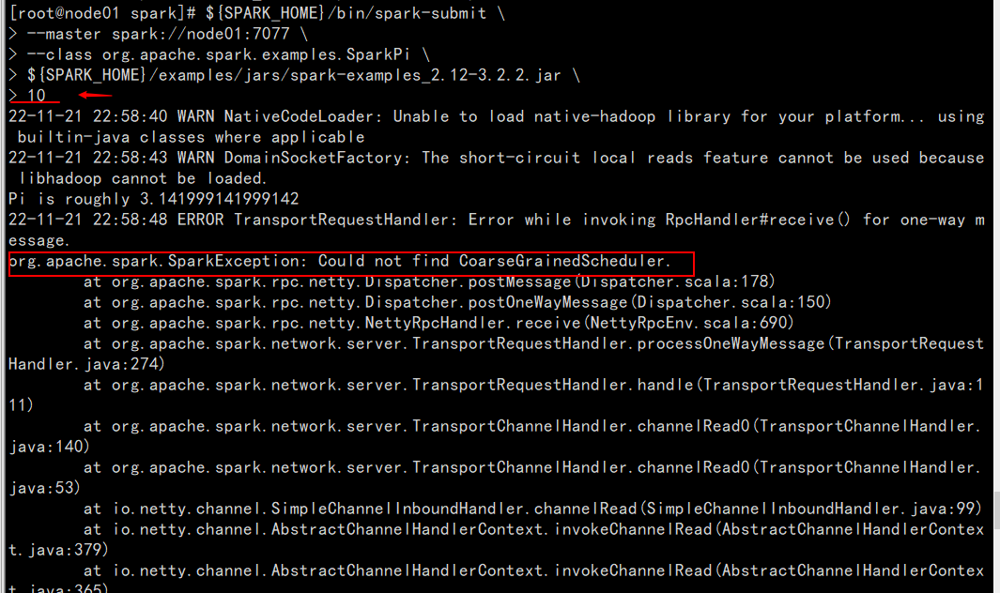

>spark版本：spark-3.2.2-bin-hadoop2.7
>
>

### 运行方式

#### 一、spark-shell

##### 1.local

>```shell
>#进入Spark安装目录
>cd /export/servers/spark
>#直接使用spark-shell，默认使用local[*]
>bin/spark-shell
># 或者
>bin/spark-shell --master local[2]
>```
>
>+ spark-shell说明
>	+ 1.直接使用spark-shell 表示使用local模式启动，在本机启动一个sparkSubmit进程；
>	+ 2.还可指定参数 --master, 如：
>		+ spark-shell --master local[N] 表示在本地模拟N个线程来运行当前任务
>		+ spark-shell --master local[*] 表示使用当前机器上所有可用的资源
>	+ 3.不携带参数默认就是
>		+ spark-shell --master local[*]
>	+ 4.后续还可以使用--master指定集群地址，表示把任务提交到集群上运行，如
>		+ spark-shell --master spark://node01:7077, node02:7077
>	+ 5.退出spark-shell
>		+ 使用 :quit
>
>
>```
>val textFile = sc.textFile("file:///export/data/spark_test_data.txt")
>val counts = textFile.flatMap(_.split(" ")).map((_, 1)).reduceByKey(_+_)
>
>val textFile = sc.textFile("hdfs://node01:8020/wordcount/input/words.txt")
>val counts = textFile.flatMap(_.split(" ")).map((_,1)).reduceByKey(_+_)
>counts.saveAsTextFile("hdfs://node01:8020/user/mappoi/data/spark_test/word_count/")
>```
>
>+ 监控界面：
>
>	+ 每个Spark Application应用运行时，启动Web UI监控页面，默认端口号为4040；
>
>		可以使用浏览器打开页面。
>
>	+ http://node03:4040/jobs/
>
>

##### 2. standalone

>+ Standalone模式是Spark自带的一种集群模式，不同于前面本地模式启动多个进程来模拟集群的环境，Standalone模式是真实地在多个机器之间搭建Spark集群的环境，完全可以利用该模式搭建多机器集群，用于实际的大数据处理。
>+ 集群角色
>	+ 主节点Master
>		+ 管理整个集群资源，接收提交应用，分配资源给每个应用，运行Task任务；
>	+ 从节点Workers
>		+ 管理每个机器的资源，分配对应的资源来运行Task；
>		+ 每个从节点分配资源信息给Worker管理，资源信息包含内存Memory和CPU Cores核数
>	+ 历史服务器HistoryServers(可选)
>		+ Spark Application运行完成以后，保存事件日志数据至HDFS, 启动HistoryServer可以查看应用运行相关信息。
>+ 部署
>
>```
>#修改Slaves
>#进入配置目录
>cd /export/servers/spark/conf
>#修改配置文件名称
>mv workers.template workers
>#1.修改文件slaves
>vim slaves
>内容如下：
>node01
>node02
>node03
>#2.修改文件spark-env.sh
>mv spark-env.sh.template spark-env.sh
>vim spark-env.sh
>增加如下内容：
>## 设置Java安装目录
>JAVA_HOME=/export/servers/jdk
>## 指定Spark老大Master的IP和提交任务的通信端口
>export SPARK_MASTER_HOST=node03
>export SPARK_MASTER_PORT=7077
>
>SPARK_MASTER_WEBUI_PORT=8080
>SPARK_WORKER_CORES=1
>SPARK_WORKER_MEMORY=1g
>
>#3.分发其它机器
>cd /export/servers/
>scp -r spark-3.2.2-bin-hadoop2.7 root@node01:$PWD
>scp -r spark-3.2.2-bin-hadoop2.7 root@node02:$PWD
>
>#3个节点上都创建软连接
>ln -s /export/servers/spark-3.2.2-bin-hadoop2.7 /export/server/spark
>```
>
>+ 集群启动与停止
>
>```
>#在主节点上启动spark集群
>/export/servers/spark/sbin/start-all.sh
>#在主节点上停止spark集群
>/export/server/spark/sbin/stop-all.sh
>```
>
>+  
>+  
>+   
>+ 单独启动和停止
>
>```
>#在Master安装节点上启动和停止 master：
>start-master.sh
>stop-master.sh
>#在Master所在节点上启动和停止Worker（work指的是Slaves 配置文件中的主机名）
>start-slaves.sh
>stop-slaves.sh
>```
>
>+ 监控界面WEB UI界面
>	+ http://node03:8080/
>+ 浅尝
>
>```
>/export/servers/spark/bin/spark-shell --master spark://node03:7077
>
>#运行程序（与HDFS交互，指定namenode节点IP文件通信端口号）
>sc.textFile("hdfs://node03:8020/wordcount/input/words.txt")
>.flatMap(_.split(" ")).map((_,1)).reduceByKey(_+_)
>.saveAsTextFile("hdfs://node03:8020/user/mappoi/data/spark_test/word_count/output2")
>
>
>hdfs dfs -text /user/mappoi/data/spark_test/word_count/output2/part*
>```
>
>+ **注意**
>	+ 集群模式下程序是在集群上运行的，不要直接读取本地文件，应该读取HDFS上的因为程序运行在集群上，具体在那个节点我们运行时并不知道，其它节点可能并没有那个数据文件；
>
>+ SparkContext WEB UI (那个节点执行spark-shell，哪个节点就有)
>	+ http://node03:4040/jobs/   |   http://node01:4040/jobs/   |  http://node02:4040/jobs/  
>+ 查看Master主节点WEB UI界面
>	+ http://node03:8080/
>	+  

##### 3. Standalone-HA (每个节点都可以成为Master，可以不只2个)

>+ 部署
>
>```
>#先停止Spark集群
>/export/servers/spark/sbin/stop-all.sh
>
>#1.在node03上配置：
>vim /export/servers/spark/conf/spark-env.sh
>#注释或删除MASTER_HOST内容：
># SPASRT_MASTER_HOST=node03
>#增加如下配置
>SPAKR_DAEMON_JAVA_OPTS="-Dspark.deploy.recoveryMode=ZOOKEEPER -Dspark.deploy.zookeeper.url=node01:2181,node02:2181,node03:2181 -Dspark.deploy.zookeeper.dir=/spark-ha"
>
>参数含义说明：
>spark.deploy.recoveryMode:恢复模式
>spark.deploy.zookeeper.url: Zookeeper的Server地址
>spark.deploy.zookeeper.dir: 保存集群元数据信息的文件、目录。包含Worker、Driver、Application信息
>
>#2.将spark-env.sh分发集群
>cd /export/server/spark/conf
>scp -r spark-env.sh root@node01:$PWD
>scp -r spark-env.sh root@node02:$PWD
>
>#3.启动集群服务
>#启动ZOOKEEPER服务
>zkServer.sh status
>zkServer.sh stop
>zkServer.sh start
>
>#4.在node03启动Spark集群并且在node02再单独启个Master
>/export/servers/spark/sbin/start-all.sh
>/export/servers/spark/sbin/start-master.sh
>
>查看WEBUI
>http://node03:8080/
>http://node02:8080/
>
>```
>
> 
>
>+ 启动spark-shell，可以指定多个master地址
>	+ /bin/spark-shell --master spark://node03:7077,node02:7077,node01:7077
>+ 可以指定多个master；
>+ 但要去停止master得去所在节点去停止；


#### 二、spark-submit

##### 1.Spark On Yarn

###### 1.部署

>+ 依赖：
>	+ 需要Yarn集群：已安装
>	+ 需要提交工具：spark-submit命令 ，在spark/bin目录中
>	+ 需要被提交的jar：Spark任务的Jar包（如：spark/example/jars中有示例程序，或我们后续自己开发的Spark任务)
>	+ 需要其它依赖jar：Yarn的JVM运行Spark的字节码需要Spark的Jar包支持，Spark安装目录中有jar包，在spark/jars/中。
>+ 总结：
>	+ Spark On Yarn 不需要搭建Spark集群，只需要Yarn集群 + 单机版Spark （里面有提交命令，依赖jar，示例jar，当然还有一些配置）
>	+ 当Spark Application运行到Yarn上时，在提交应用时指定master为yarn即可，同时需要告知YARN集群配置信息（比如ResourceManager地址信息），此外需要监控Spark Application,配置历史服务器相关属性。
>+ 部署
>
>```
>#修改spark-env.sh
>cd /export/servers/spark/conf
>vim /export/servers/spark/conf/spark-env.sh
>#添加内容
>## HADOOP软件配置文件目录，读取HDFS上文件和运行YARN集群
>HADOOP_CONF_DIR=/export/servers/hadoop/etc/hadoop
>YARN_CONF_DIR=/export/servers/hadoop/etc/hadoop
>
>#同步其它节点
>cd /export/servers/spark/conf
>scp -r spark-env.sh root@node01:$PWD
>scp -r spark-env.sh root@node02:$PWD
>```
>
>+ 整合历史服务器并关闭资源检查
>
>	+ 在 $HADOOP_HOME/etc/hadoop/yarn-site.xml, 配置文件中，指定MRHistroyServer地址信息，添加如下内容，在node03修改
>
>		+ cd /export/servers/hadoop/etc/hadoop
>
>		+ vim /export/servers/hadoop/etc/hadoop/yarn-site.xml
>
>		+ 添加内容
>
>		+ ```xml
>			<configuration>
>			    <!-- 配置yarn主节点的位置 -->
>			    <property>
>			        <name>yarn.resourcemanager.hostname</name>
>			        <value>node1</value>
>			    </property>
>			    <property>
>			        <name>yarn.nodemanager.aux-services</name>
>			        <value>mapreduce_shuffle</value>
>			    </property>
>			    <!-- 设置yarn集群的内存分配方案 -->
>			    <property>
>			        <name>yarn.nodemanager.resource.memory-mb</name>
>			        <value>20480</value>
>			    </property>
>			    <property>
>			        <name>yarn.scheduler.minimum-allocation-mb</name>
>			        <value>2048</value>
>			    </property>
>			    <property>
>			        <name>yarn.nodemanager.vmem-pmem-ratio</name>
>			        <value>2.1</value>
>			    </property>
>			    <!-- 开启日志聚合功能 -->
>			    <property>
>			        <name>yarn.log-aggregation-enable</name>
>			        <value>true</value>
>			    </property>
>			    <!-- 设置聚合日志在hdfs上的保存时间 -->
>			    <property>
>			        <name>yarn.log-aggregation.retain-seconds</name>
>			        <value>604800</value>
>			    </property>
>			    <!-- 设置yarn历史服务器地址 -->
>			    <property>
>			        <name>yarn.log.server.url</name>
>			        <value>http://node1:19888/jobhistory/logs</value>
>			    </property>
>			    <!-- 关闭yarn内存检查 -->
>			    <property>
>			        <name>yarn.nodemanager.pmem-check-enabled</name>
>			        <value>false</value>
>			    </property>
>			    <property>
>			        <name>yarn.nodemanager.vmem-check-enabled</name>
>			        <value>false</value>
>			    </property>
>			</configuration>
>			```
>
>			
>
>		+ 由于使用虚拟机运行服务，默认情况下YARN会检查机器内存，当内存不足时，提交的应用无法运行，可以设置不检查资源
>
>		+ 同步其它节点
>
>			+ cd /export/server/hadoop/etc/hadoop
>			+ scp -r yarn-site.xml root@node01:$PWD
>			+ scp -r yarn-site.xml root@node02:$PWD
>
>	+ 配置spark历史服务器
>
>		```
>		##进去配置目录
>		cd /export/servers/spark/conf
>		##修改配置文件名称
>		mv spark-defaults.conf.templates spark-defaults.conf
>		vim spark-defaults.conf
>		##添加内容：
>		spark.eventLog.enabled true
>		spark.eventLog.dir hdfs://node01:8020/sparklog/
>		spark.eventLog.compress true
>		spark.yarn.historyServer.address node01:18080
>		
>		##修改spark-env.sh
>		#进入配置目录
>		cd /export/servers/spark/conf
>		#修改配置文件
>		vim spark-env.sh
>		#增加如下内容：
>		##配置spark历史服务器地址
>		SPARK_HISTORY_OPTS="-Dspark.history.fs.logDirectory=hdfs://node01:8020/sparklog/ -Dspark.history.fs.cleaner.enabled=true"
>		
>		#注意：sparklog目录需要手动创建
>		hdfs dfs -mkdir -p /sparklog
>		
>		#设置日志级别
>		#进入目录
>		cd /export/servers/spark/conf
>		#修改日志属性配置文件名称
>		mv log4j.properties.template log4j.properties
>		#改变日志级别
>		vim log4j.properties
>		#修改内容如下：
>		log4j.rootCategory=WARN, console
>		log4j.appender.console=org.apache.log4j.ConsoleAppender
>		log4j.appender.console.target=System.err
>		log4j.appender.layout=org.apache.log4j.PatternLayout
>		log4j.appender.console.layout.ConversionPatterm=%d{yy-MM-dd HH:mm:ss} %p %c{1}: &m%n
>		
>		#同步其它节点
>		cd /export/servers/spark/conf
>		scp -r spark-env.sh root@node01:$PWD
>		scp -r spark-env.sh root@node02:$PWD
>		scp -r spark-defaults.conf root@node01:$PWD
>		scp -r spark-defaults.conf root@node02:$PWD
>		scp -r log4j.properties root@node01:$PWD
>		scp -r log4j.properties root@node02:$PWD
>		```
>
>+ 配置依赖Spark Jar包
>
>	+ 当Spark Application应用提交运行在Yarn上时，默认情况下，每次提交应用都需要将依赖Spark相关jar包上传到YARN集群中，为了节省提交时间和存储时间，将Spark相关jar包上传到HDFS目录中，设置属性告知Spark Application应用。
>
>	+ ```
>		##hdfs上创建存储Spark相关jar包目录
>		hdfs dfs -mkdir -p /spark/jars/
>		##上传$SPARK_HOME/jars所有jar包
>		hdfs dfs -put /export/server/spark/jars/* /spark/jars
>		
>		#在spark-defaults.conf中增加Spark相关jar包位置信息
>		#在node03上操作
>		vim /export/server/spark/conf/spark-defaults.conf
>		#添加内容
>		spark.yarn.jars hdfs://node01:8020/spark/jars/*
>		
>		同步其它节点
>		cd /export/server/spark/conf
>		scp -r spark-defaults.conf root@node01:$PWD
>		scp -r spark-defaults.conf root@node02:$PWD
>		```
>
>	+ 启动服务
>
>		+ 启动服务：HFDS、YARN、MRHistoryServer和Spark HistoryServer，命令如下：
>
>		+ ```
>			##启动HDFS和YARN服务，在node01执行命令
>			start-dfs.sh
>			start-yarn.sh
>			或
>			start-all.sh
>			## 启动MRHistoryServer服务，在node01上执行命令
>			mr-jobhistory-daemon.sh start historyserver
>			## 启动Spark HistoryServer服务，在node03执行命令
>			/export/server/spark/sbin/start-history-server.sh
>			```
>
>		+ Spark HistoryServer服务WEB UI页面地址：
>
>			+ http://node01:18080/

###### 2.Spark on Yarn 两种模式

>+ 当Spark应用提交在集群上运行时，应用架构由两部分组成：Driver Program（资源申请和调度Job执行） 和 Executors(运行Job中Task任务和缓存数据)，都是JVM Process进程：
>	+  
>+ Dirver程序运行的位置可以通过--deploy-mode来指定
>	+ client :表示Driver运行在提交应用的Client上（默认）
>	+ cluster:表示Driver运行在集群中(Standalone:Worker, Yarn:NodeManager)
>+ Driver是什么：
>	+ 运行应用程序的main()函数并创建SparkContext的进程；
>+ 注意：
>	+ cluster和client模式最最本质的区别是：Driver程序运行在哪里。
>	+ 企业实际生产环境中使用cluster
>
>

###### 3.client模式

>+ DeployMode为Client,表示应用Driver Program运行在提交应用Client主机上，示意图如下：
>	
>+  
>	
>+ 浅尝
>
>	+ 运行圆周率PI程序，采用client模式，命令如下：
>
>	+ ```
>		SPARK_HOME=/export/servers/spark
>		${SPARK_HOME}/bin/spark-submit \
>		--master yarn \
>		--deploy-mode client \
>		--driver-memory 512m \
>		--executor-memory 512m \
>		--num-executor-cores 1 \
>		--total-executor-cores 3 \
>		--class org.apache.spark.examples.SparkPi \
>		${SPARK_HOME}/examples/jars/spark-examples_2.11-2.4.5.jar \
>		10
>		```
>
>	+ 查看日志：http://node01:8088/cluster

###### 4.cluster模式

>+ DeployMode为Cluster,表示应用Driver Program运行在集群从节点某台机器上，示意图如下：
>
>	+  
>
>	+ 运行圆周率PI程序，采用cluster模式，命名如下：
>
>	+ ```
>		SPARK_HOME=/export/servers/spark
>		${SPARK_HOME}/bin/spark-submit \
>		--master yarn \
>		--deploy-mode cluster \
>		--driver-memory 512m \
>		--executor-memory 512m \
>		--num-executors 1 \
>		--total-executor-cores 3 \
>		--class org.apache.spark.examples.SparkPi \
>		${SPARK_HOME}/examples/jars/spark-examples_2.11-2.4.5.jar \
>		10
>		```
>
>	+ 查看日志：http://node01:8088/cluster
>
>

###### 5.总结

>+ Client模式和Cluster模式最最本质的区别是：Driver程序运行在哪里。
>+ Client模式：学习测试时使用，开发不用，了解即可
>	+ 1.Driver运行在Client上，和集群的通信成本高；
>	+ 2.Driver输出结果会在客户端显示；
>+ Cluster模式：生产环境中使用该模式
>	+ 1.Driver程序在Yarn集群中，和集群的通信成本低；
>	+ 2.Driver输出结果不能在客户端显示；
>	+ 3.该模式下Driver运行ApplicationMaster这个节点上，由Yarn管理，如果出现问题，Yarn会重启ApplicationMaster(Driver)

###### 6.两种模式详细流程

>+ **Client模式**
>
>	+ 在Yarn Client模式下，Driver在提交的本地机器上运行，示意图如下：
>
>		+ 
>
>	+ 具体流程步骤如下：
>
>		+ 1>Driver在任务提交的本地机器上运行，Driver启动后会和ResourceManager通讯申请启动ApplicationMaster;
>
>			+ ```
>				--master yarn \
>				--deploy-mode client \
>				--driver-memory 2G \
>				```
>
>		+ 2>随后ResourceManager分配Container，在合适的NodeManager上启动ApplicationMaster，此时的ApplicationMaster的功能相当于一个ExecutorLaucher，只负责向ResourceManager申请Executor内存；
>
>			+ ```
>				--executor-memory 10G \
>				--executor-cores 4 \
>				--num-executors 10 \
>				```
>
>		+ 3>ResourceManager接到ApplicationMaster的资源申请后会分配Container，然后ApplicationMaster在资源分配指定的NodeManager上启动Executor进程；
>
>		+ 4>Executor进程启动后会向Driver反向注册，Executor全部注册完成后Driver开始执行mian函数；
>
>		+ 5>之后执行到Action算子时，触发一个Job，并根据宽依赖开始划分Stage,每个Stage生成对应的TaskSet,之后将Task分发到各个Executor上执行；
>
>+ **Cluster模式**
>
>	+ 在Yarn Cluster模式下，Driver运行在NodeManager Container中，此时Driver与AppMaster合为一体，示意图如下：
>
>		+  
>
>	+ 具体流程步骤如下：
>
>		+ 1>任务提交后会和ResouceManager通讯申请启动ApplicationMaster;
>
>		+ 2>随后ResourceManager分配Container,在合适的NodeManager上启动ApplicationMaster，此时的ApplicationMaster就是Driver;
>
>			+ ```
>				--master yarn \
>				--deploy-mode cluster \
>				--driver-memory 2G \
>				--driver-cores 1 \
>				```
>
>		+ 3>Driver启动后向ResourceManager申请Executor内存，ResourceManager接到ApplicationMaster的资源申请后会分配Container,然后再合适的NodeManager上启动Executor进程；
>
>			+ ````
>				--executor-memory 10G \
>				--executor-cores 4 \
>				--num-executors 10 \
>				````
>
>		+ 4>Executor进程启动后会向Driver反向注册；
>
>		+ 5>Executor全部注册完成后，Driver开始执行main函数，之后执行到Action算子时，触发一个Job，并根据宽依赖开始划分stage，每个stage生成对应的taskSet，之后将task分发到各个Executor上执行；

###### 7.Spark集群角色

>+ 当Spark Application运行在集群上时，主要由四个部分组成，如下示意图：
>	+  
>	+ 1>Driver：是一个JVM Process进程，编写的Spark应用程序就运行在Driver上，由Driver进程执行；
>	+ 2>ClusterManager
>		+ 对于standalone集群，他具体时Master
>		+ 对于Yarn来说，他具体是ResourceManager
>		+ 是一个JVM Process进程，主要负责资源的调度和分配，并进行集群的监控等职责；
>	+ 3>Worker Node
>		+ 对于standalone集群，它具体是Worker
>		+ 对于Yarn来说，它具体是NodeManager
>		+ 是一个JVM Process进程，一个Worker运行在集群中的一台服务器上，主要负责两个职责，一个是用自己的内存存储RDD的某个或者某些partition；另一个是启动其它进程和线程（Executor)，对于RDD上的partition进行并行的处理和计算；
>	+ 4>Executor：是一个JVM Process进程，一个Worker或NodeManager上可以运行多个Executor, Executor通过启动多个线程（task）来执行对RDD的partition进行并行计算，也就是执行我们对RDD定义的例如map、flatMap、reduce等算子操作。
>
>

###### 8.spark-shell 和 spark-submit

>+ Spark支持多种集群管理器（Cluster Manager），取决于传递给SparkContext的Master环境变量的值：local、spark、yarn，区别如下：
>	+ local：在本地运行，只要一个工作进程，无并行计算能力。
>	+ local[K]： 在本地运行，有K个工作进程，通常设置K为机器的CPU核心数量。
>	+ local[*]：在本地运行，工作进程数量等于机器的CPU核心数量；
>	+ spark://HOST:PORT ：以stanalone模式运行，这是Spark自身提供的集群运行模式，默认端口号：7077；
>		+ Client部署模式：7077
>		+ Cluster部署模式：6066
>	+ mesos://HOST:PORT：在Mesos集群上运行，Driver进程和Worker进程运行在Mesos集群上，部署模式必须使用固定值：--deploy-mode cluster；
>	+ yarn-client --master yarn --deploy-mode client
>		+ 在yarn集群上运行，Driver进程在本地，Executor进程在Yarn集群上，部署模式必须使用固定值： --deploy-mode client。 yarn集群地址必须HADOOP_CONF_DIR or YARN_CONF_DIR变量定义。
>	+ yarn-cluster --master yarn --deploy-mode cluster
>		+ 在yarn集群上运行，Dirver进程在yarn集群上，Execuctor进程也在Yarn集群上，部署模式必须使用固定值：--deploy-mode cluster。yarn集群地址必须在HADOOP_CONF_DIR or YARN_CONF_DIR变量里定义；
>
>

###### 9.spark-shell

>+ 之前我们使用提交任务都是使用spark-shell提交，spark-shell是Spark自带的交互式Shell程序，方便用于进行交互式编程，用于可以在该命令行下可以用scala编写spark程序，适合学习测试时使用：
>	+ 示例：
>	+ spark-shell可以携带参数
>	+ spark-shell --master local[N] 数字N表示在本地模拟N个线程来运行当前任务；
>	+ spark-shell --master local[*] *表示使用当前机器上所有可用的资源；
>	+ 默认不携带参数就是 --master local[*]
>	+ spark-shell --master spark://node01:7077,node02:7077 表示运行在集群上；

###### 10.spark-submit

>+ spark-shell交互式编程确实很方便我们进行学习测试，但是在实际中我们一般使用IDEA开发Spark应用程序达成Jar包交给Spark集群/Yarn去执行，所以我们还得学习一个spark-submit命令用来帮我们提交jar包给spark集群/Yarn
>
>	+ spark-submit命令是我们开发时常用的；
>
>+ 示例：
>
>	+ ```
>		SPARK_HOME=/export/servers/spark
>		${SPARK_HOME}/bin/spark-submit \
>		--master local[2] \
>		--class org.apache.spark.examples.SparkPi \
>		${SPARK_HOME}/examples/jars/spark-examples_2.11-2.4.5.jar \
>		10
>		
>		```
>
>	+ ```
>		SPARK_HOME=/export/servers/spark
>		${SPARK_HOME}/bin/spark-submit \
>		--master spark://node01:7077 \
>		--class org.apache.spark.examples.SparkPi \
>		${SPARK_HOME}/examples/jars/spark-examples_2.11-2.4.5.jar \
>		10
>		```
>
>	+ ```
>		SPARK_HOME=/export/servers/spark
>		${SPARK_HOME}/bin/spark-submit \
>		--master spark://node01:7077,node02:7077 \
>		--class org.apache.spark.examples.SparkPi \
>		${SPARK_HOME}/examples/jars/spark-examples_2.11-2.4.5.jar \
>		10
>		```

###### 11.参数配置

>+ 基本参数配置：
>
>	+ 提交运行Spark Application时，有些基本参数需要传递值，如下所示：
>
>	+ ```
>		#表示应用运行的模式，要么是本地local，要么是集群（Standalone、Yarn、Mesos)
>		--master MASTER_URL
>				#本地模式：local[2] Standalone集群：spark://xxx:7077, yyy:7077   Yarn集群：yarn
>		
>		#表示Driver Program运行的地方，也叫做应用部署模式，默认值为client，通常在生成环境中使用Cluster
>		--deploy-mode DEPLOY_MODE
>		
>		#表示运行Spark Application的类名称，注意为类的全名称（包含包名）
>		--class CLASS_NAME
>		
>		#表示的是应用运行的名称，通常在应用开发的时候指定
>		--name NAME 
>		
>		#表示应用的类所依赖的第三方的Jar包指定的路径，通常在本地文件系统中，多个Jar包使用逗号隔开
>		--jars JARS
>		
>		#表示应用运行时指定的某些参数配置 http://spark.apache.org/docs/2.2.0/configuration.html
>		--conf PROP=VALUE
>		
>		#当value中值由空格组成的时候，使用双引号将key=value引起来
>		--conf "PROP=VALUE"
>		
>		```
>
>	+ 动态加载Spark Application运行时的参数，通过--conf进行指定，如下使用方式：
>
>	+ ```
>		#第一种方式：属性的值中没有空格
>		--conf spark.eventLog.enabled=false
>		
>		#第二种方式：属性的值中有空格，将属性和值统一使用双引号引起来
>		--conf "spark.execuctor.extraJavaOptions=-XX:+PrintGCDetails -XX:+PrintGCTimeStamps"
>		```
>
>+ Driver Program参数配置
>
>	+ 每个Spark Application运行时都有一个Driver Program，属于一个JVM Process进程，可以设置内存Memory和CPU Core核数；
>
>	+ ```
>		# 指定Driver Program JVM进程内存大小，默认值为1g
>		--driver-memory MEM
>		
>		# 表示Driver运行CLASS PATH路径，使用不多
>		--driver-class-path
>		
>		# Spark standalone with cluster deploy mode: 运行在Standalone中cluster deploy mode, 默认值为1
>		--driver-cores NUM
>		
>		#运行在YARN in cluster mode, 默认值是1
>		--driver-cores NUM
>		
>		#运行在standalone的中cluster deploy mode下，表示当Driver运行异常失败，可以自己重启
>		--supervise
>		```
>
>+ Executor 参数配置
>
>	+ 每个Spark Application运行中，需要启动Executor运行任务Task,需要指定Executor个数及每个Executor资源信息（内存Memory和CPU Core核数)
>
>	+ ```
>		# Executor运行所需内存大小
>		--executor-memory MEM
>		
>		# Executor运行的CPU Cores，默认的情况下，在Standalone集群上为worker节点所有可能的CPU Cores,在Yarn集群下为1
>		--executor-cores NUM
>		
>		#表示运行在Standalone集群下，所有Executor和CPU Cores,结合--executor-cores计算出Executor个数
>		--total-executor-cores NUM
>		
>		#表示在YARN集群下，Executor的个数，默认值为2
>		--num-executors
>		
>		#表示Executor运行的队列，默认为default队列
>		--queue QUEUE_NAME
>		```
>
>	+ 
>
>

###### 12.官网案例

>+ Spark 官方提供一些针对不同模式运行Spark Application如何设置参数提供案例,具体如下：
>
>	+ ```
>		./bin/spark-submit \
>		--class org.apache.spark.example.sparkPi \
>		--master local[8]
>		/path/to/examples.jar
>		100
>		
>		
>		./bin/spark-submit \
>		--class org.apache.spark.examples.SparkPi \
>		--master spark://node01:7077 \
>		--executor-memory 20G \
>		--total-executor-cores 100 \
>		/path/to/examples.jar \
>		1000
>		
>		
>		./bin/spark-submit \
>		--class org.apache.spark.examples.SparkPi \
>		--master spark://node01:7077 \
>		--deploy-mode cluster \
>		--supervise \
>		--executor-memory 20G \
>		--total-executor-cores 100 \
>		/path/to/examples-jar \
>		1000
>		
>		
>		export HADOOP_CONF_DIR=xxx\
>		./bin/spark-submit \
>		--class org.apache.spark.examples.SparkPi \
>		--master yarn \
>		--deploy-mode cluster \
>		--executor-memory 20G \
>		--num-executors 50 \
>		/path/to/examples.jar \
>		1000
>		
>		
>		./bin/spark-submit \
>		--master spark://node01:7077 \
>		examples/src/main/python/pi.py \
>		1000
>		
>		./bin/spark-submit \
>		--class org.apache.spark.examples.SparkPi \
>		--master mesos://node01:7077 \
>		--deploy-mode cluster \
>		--supervise \
>		--executor-memory 20G \
>		--total-executor-cores 100 \
>		http://path/to/examples.jar \
>		1000
>		
>		./bin/spark-submit \
>		--class org.apache.spark.examples.SparkPi \
>		--master k8s://node01:443 \
>		--deploy-mode cluster \
>		--executor-memory 20G \
>		--num-executors 50 \
>		http://path/to/examples.jar \
>		1000
>		```
>
>	+  
>
>	+ 并行度太高造成的，10改成3就能执行了，或者如下操作
>
>	+  

#### 三、Spark应用开发-基于IDEA

>+ 实际开发Spark应用程序使用IDEA集成开发环境，Spark课程所有代码均使用Scala语言开发，利用函数式编程分析处理数据，更加清晰简洁。
>+ 企业中也使用Java语言开发Spark程序，但较少；
>
>

##### 1.创建工程

>+ 创建Maven Project工程：
>
>+ 添加依赖至POM文件中，内容如下：
>
>+ ```
>	<?xml version="1.0" encoding="UTF-8"?>
>	<project xmlns="http://maven.apache.org/POM/4.0.0"
>	         xmlns:xsi="http://www.w3.org/2001/XMLSchema-instance"
>	         xsi:schemaLocation="http://maven.apache.org/POM/4.0.0 http://maven.apache.org/xsd/maven-4.0.0.xsd">
>	    <modelVersion>4.0.0</modelVersion>
>	
>	    <groupId>cn.itcast</groupId>
>	    <artifactId>spark_learn</artifactId>
>	    <version>1.0</version>
>	
>	    <repositories>
>	        <repository>
>	            <id>aliyun</id>
>	            <url>http://maven.aliyun.com/nexus/content/groups/public/</url>
>	        </repository>
>	        <repository>
>	            <id>apache</id>
>	            <url>https://repository.apache.org/content/repositories/snapshots/</url>
>	        </repository>
>	        <repository>
>	            <id>cloudera</id>
>	            <url>https://repository.cloudera.com/artifactory/cloudera-repos/</url>
>	        </repository>
>	    </repositories>
>	    <properties>
>	        <encoding>UTF-8</encoding>
>	        <maven.compiler.source>1.8</maven.compiler.source>
>	        <maven.compiler.target>1.8</maven.compiler.target>
>	        <scala.version>2.11.12</scala.version>
>	        <hadoop.version>2.7.5</hadoop.version>
>	        <spark.version>2.4.5</spark.version>
>	    </properties>
>	    <dependencies>
>	        <!--依赖Scala语言-->
>	        <dependency>
>	            <groupId>org.scala-lang</groupId>
>	            <artifactId>scala-library</artifactId>
>	            <version>${scala.version}</version>
>	        </dependency>
>	        <!--SparkCore依赖-->
>	        <dependency>
>	            <groupId>org.apache.spark</groupId>
>	            <artifactId>spark-core_2.11</artifactId>
>	            <version>${spark.version}</version>
>	        </dependency>
>	        <!--SparkSQL依赖-->
>	        <dependency>
>	            <groupId>org.apache.spark</groupId>
>	            <artifactId>spark-sql_2.11</artifactId>
>	            <version>${spark.version}</version>
>	        </dependency>
>	        <!--SparkSQL+ Hive依赖-->
>	        <dependency>
>	            <groupId>org.apache.spark</groupId>
>	            <artifactId>spark-hive_2.11</artifactId>
>	            <version>${spark.version}</version>
>	        </dependency>
>	        <dependency>
>	            <groupId>org.apache.spark</groupId>
>	            <artifactId>spark-hive-thriftserver_2.11</artifactId>
>	            <version>${spark.version}</version>
>	        </dependency>
>	        <!-- spark-streaming-->
>	        <dependency>
>	            <groupId>org.apache.spark</groupId>
>	            <artifactId>spark-streaming_2.11</artifactId>
>	            <version>${spark.version}</version>
>	        </dependency>
>	        <dependency>
>	            <groupId>org.apache.spark</groupId>
>	            <artifactId>spark-mllib_2.11</artifactId>
>	            <version>${spark.version}</version>
>	        </dependency>
>	        <!--spark-streaming+Kafka依赖-->
>	        <dependency>
>	            <groupId>org.apache.spark</groupId>
>	            <artifactId>spark-streaming-kafka-0-10_2.11</artifactId>
>	            <version>${spark.version}</version>
>	        </dependency>
>	        <!--StructuredStreaming+Kafka依赖-->
>	        <dependency>
>	            <groupId>org.apache.spark</groupId>
>	            <artifactId>spark-sql-kafka-0-10_2.11</artifactId>
>	            <version>${spark.version}</version>
>	        </dependency>
>	
>	        <dependency>
>	            <groupId>org.apache.hadoop</groupId>
>	            <artifactId>hadoop-client</artifactId>
>	            <version>2.7.5</version>
>	        </dependency>
>	
>	        <dependency>
>	            <groupId>mysql</groupId>
>	            <artifactId>mysql-connector-java</artifactId>
>	            <version>5.1.38</version>
>	        </dependency>
>	        <dependency>
>	            <groupId>com.alibaba</groupId>
>	            <artifactId>fastjson</artifactId>
>	            <version>1.2.47</version>
>	        </dependency>
>	
>	        <dependency>
>	            <groupId>com.hankcs</groupId>
>	            <artifactId>hanlp</artifactId>
>	            <version>portable-1.7.7</version>
>	        </dependency>
>	
>	    </dependencies>
>	
>	    <build>
>	        <outputDirectory>target/classes</outputDirectory>
>	        <testOutputDirectory>target/test-classes</testOutputDirectory>
>	        <resources>
>	            <resource>
>	                <directory>src/main/resources</directory>
>	            </resource>
>	        </resources>
>	        <plugins>
>	            <plugin>
>	                <groupId>org.apache.maven.plugins</groupId>
>	                <artifactId>maven-compiler-plugin</artifactId>
>	                <version>3.0</version>
>	                <configuration>
>	                    <source>1.8</source>
>	                    <target>1.8</target>
>	                    <encoding>UTF-8</encoding>
>	                </configuration>
>	            </plugin>
>	            <plugin>
>	                <groupId>net.alchim31.maven</groupId>
>	                <artifactId>scala-maven-plugin</artifactId>
>	                <version>3.2.0</version>
>	                <executions>
>	                    <execution>
>	                        <goals>
>	                            <goal>compile</goal>
>	                            <goal>testCompile</goal>
>	                        </goals>
>	                    </execution>
>	                </executions>
>	            </plugin>
>	        </plugins>
>	    </build>
>	
>	</project>
>	```
>
>+ 
>
>

#### 四、spark-sql (Spark On Hive)

>+ SparkSQL集成hive的本质是读取Hive框架元数据MetaStore，此处启动Hive MetaStore服务即可。
>	+ nohup /export/servers/hive/bin/hive --service metastore &
>
>+ 编写配置文件 hive-site.xml 并放于node03的 【$SPARK_HOME/conf】目录
>
>	+ cd /export/servers/spark/conf
>
>	+ vim hive-site.xml
>
>	+ ```xml
>		<?xml version="1.0"?>
>		<?xml-stylesheet type="text/xsl" href="configuration.xsl"?>
>		<configuration>
>		    <property>
>		      <name>hive.metastore.warehouse.dir</name>
>		      <value>/user/hive/warehouse</value>
>		    </property>
>		    <property>
>		      <name>hive.metastore.local</name>
>		      <value>false</value>
>		    </property>
>		    <property>
>		      <name>hive.metastore.uris</name>
>		      <value>thrift://node03:9083</value>
>		    </property>
>		 </configuration>
>		```
>
>	+ 也可以将hive-site.xml分发到集群中所有Spark的conf目录，此时任务机器启动应用都可以访问Hive表数据。
>
>+ 使用sparksql操作hive
>
>	+ ```
>		/export/servers/spark/bin/spark-sql \
>		--master local[2] \
>		--conf spark.sql.shuffle.partitions=2
>		```
>
>+  

